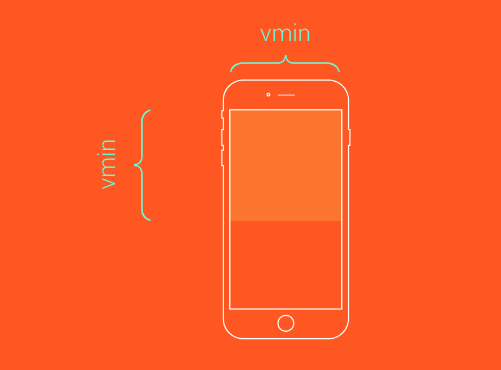
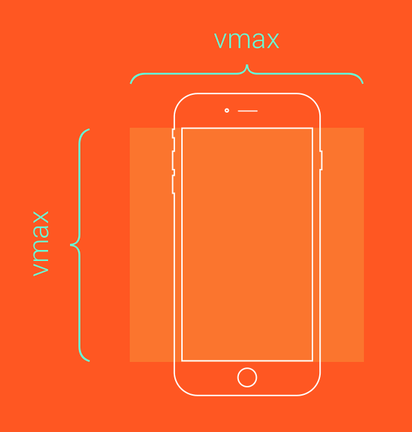

#CSS의 7가지 단위

- em과 rem 모두 길이가 유연한 가변 단위로서, 디자인에 설정된 폰트 크기에 따라 브라우저에 의해 픽셀값으로 변환됩니다. 
 만약에 1em 혹은 1rem 값을 지정했다면, 브라우저에 의해 16px부터 160px 까지, 아니면 기타 다양한 값으로 변환될 수 있습니다.


## rem
    - 최상위 Element의 font-size를 기준하여 계산되는 크기 단위
    - 예 : html Element의 font-size : 16px 이면, 10rem은 160px
    ```
    rem 단위를 써야할 때:
    ```

## em
    - 해당 Element의 font-size를 기준하여 계산되는 크기 단위
    - 예 : 한 div의 font-zie : 16px 이면, 10em은 160px
    - 해당 Element의 font-size를 명시하지 않으면 상위 font-size로부터 영향을 받는다.
    ```
    왜 em 단위를 써야 하는가?
    em 단위가 가지고 있는 최대 장점이라면 이놈은 html 요소 말고도 다른 요소의 폰트 크기에 따라서 변하는 특성이 있다는 것입니다.
    이런 이유로, em 단위를 쓰는 주된 목적은 디자인 요소가 지닌 특별한 상황에 따라 거기에 어울리는 변동성이 요구될 때 사용하면 좋습니다.
    예를 들어, 사이트 이동 메뉴에 속해 있는 각 항목마다 주변에 padding, margin 그리고 line-height을 설정할 때 em 값을 사용하면 좋습니다.
    
    최상위 요소 말고 기타 다른 특정 요소의 font-size를 기준으로 그 크기가 바뀌어야 하는 곳에 사용.
    ```
### rem & em 총정리
    - 디자인에 쓰인 rem과 em 단위는 폰트 크기를 기준으로 브라우저에 의해 픽셀값으로 변환됩니다.
    - em 단위는 지정된 요소의 폰트 크기를 기준으로 합니다.
    - rem 단위는 html 요소의 폰트 크기를 기준으로 합니다.
    - em 단위는 모든 상위 부모 요소로부터의 폰트 크기를 상속받으면서 영향을 받을 수 있습니다.
    - rem 단위는 브라우저에 설정된 폰트 크기를 상속받는 특성이 있습니다.

    - em 단위는 최상위 요소에 지정된 폰트 크기 말고, 다른 특정 요소의 폰트 크기에 따라 그 크기가 변해야 하는 곳에 사용하십시오.
    - rem 단위는 em 단위를 쓸 필요가 없고, 또 브라우저의 폰트 크기 설정에 따라 그 크기가 변해야 하는 곳에 사용하십시오.
    - 폰트 크기 지정을 비롯해서 꼭 em 단위를 써야 하는 곳이 아니라면 rem 단위를 사용하십시오.
    - media queries에도 rem 단위를 쓰세요.
    - 다중 칼럼 레이아웃의 너비에는 em 혹은 rem을 쓰진 마십시오 - 대신 %를 쓰세요.
    - 만약에 크기가 변할 경우 해당 요소의 레이아웃이 깨지는 걸 막을 수 없다면 em과 rem 모두 쓰지 마세요.    

- 출처 : https://webdesign.tutsplus.com/ko/tutorials/comprehensive-guide-when-to-use-em-vs-rem--cms-23984

## vw & vh ( Viewport Width & Viewport Height)
- 기본적으로 vh와 vw는 각각 view port의 높이와 너비를 의미합니다. 즉, 현재 실행중인 스크린 크기에 맞춰 상대적 크기를 반환하겠다는 뜻
    ```
    100vh, 100vw 가 전체 화면의 기준이 됩니다.

    예를들어, 현재 스크린 크기가 height = 1000px, width = 800px 이라면
    1vh = 10px  /  1vw = 8px 이 될 것이고

    height: 50vh;
    width: 25vw; 로 설정한다면

    height - 500px
    width - 200px 
    ```
    - %와 차이점?
        - %는 부모가 만들어준 공간안에서 너비 비율 -  % 는 창이 중심이 아닌, %를 쓰고 있는 요소의 부모 요소의 길이에 맞게 반환
        - vh 와 vw 는 열려있는 화면 전체의 상대길이이기 때문에 스크롤바를 포함한 길이를 반환합니다.

##  vmin & vmax (viewport minimum & viewport maximum)
- viewport 의 길이 중 더 긴 길이를 기준으로 삼으면 vmax, 더 짧은 길이를 기준으로 삼는 것은 vmin 입니다.
```
vmin 은 웹브라우저 너비와 높이 중에 더 작은 값을 기준으로 하여 100분의 1 한 값.
vmax 는 웹브라우저 너비와 높이 중에 더 큰 값을 기준으로 하여 100분의 1한 값.

브라우저 너비가 960px , 높이가 1200px 이라면 
----> 1vmin = 9.6px(960/100) , 1vmax = 12px(1200/100) 이다.
```



- 높이값과 너비값을 vmin을 사용해 100으로 지정합니다. 예를 들어 터치화면 양 변에 가득차는 정사각형 요소를 만들때는 이렇게 정의하면 됩니다.
    ```
    .box {
    height: 100vmin;
    width: 100vmin;
    }
    ```



- 만약 커버처럼 뷰포트 화면에 보여야 하는(모든 네 변이 스크린에 꽉 차 있는) 경우에는 같은 값을 vmax로 적용하면 됩니다.
    ```
    .box {
    height: 100vmax;
    width: 100vmax;
    }
    ```


## 문서구조

>   [절대경로]
>  > 어떠한 웹 페이지나 파일이 가지고 있는 고유한 경로를 절대경로라고 합니다.
>  > 웹페이지에서 이미지의 URL을 가지고 오거나 내 컴퓨터 안의 이미지 경로를 가져올 때 절대경로를 사용하는 것 입니다.
>  >  -웹페이지 이미지 주소를 불러오는경우
>  >  -내 컴퓨터 안의 이미지 경로를 불러오는 경우
>  > 위의 방식을 절대경로를 이용한 방식이라고 합니다. 그러나 절대경로를 이용하면 웹페이지의 이미지가 사라지거나 내컴퓨터에서 만든 파일을 다른 웹서버로 올릴 때에는 다시 고쳐줘야 하는 불편함이 있습니다.

>   [상대경로]
>  > 작업중인 공간을 기준으로 상대적인 위치를 가리키는 경로를 상대경로라고 합니다. 
>  > 이미지의 파일이 같은 폴더에 저장되어있을 경우 파일명만 적어주면되고 하위 폴더에 저장되어 있는 경우에는 "폴더명/이미지파일" 처럼 사용하면되고
>  > 상위 폴더에 저장되어 있는 경우에는 "../폴더명/이미지파일" 처럼 사용하시면 됩니다.
>  >  -같은 폴더안의 image사용
>  >  -하위폴더 file안의 image 사용
>  >  -상위폴더 file안의 image 사용  
